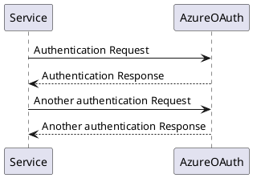

# plantuml-example

>PlantUML is an open-source tool allowing users to create diagrams from a plain text language. Besides various UML diagrams, PlantUMl has support for various other Software development related formats, as well as visualisation of JSON and YAML files. The language of PlantUML is an example of a domain-specific language [Wikipedia](https://en.wikipedia.org/wiki/PlantUML)

### Sequence Diagram
>The sequence -> is used to draw a message between two participants. Participants do not have to be explicitly declared.
To have a dotted arrow, you use -->
It is also possible to use <- and <--. That does not change the drawing, but may improve readability. Note that this is only true for sequence diagrams, rules are different for the other diagrams.

Follow me on - [Medium](https://saurabhshcs.medium.com) | [Linkedin](https://www.linkedin.com/in/saurabhshcs/) | [YouTube](https://www.youtube.com/channel/UCSQqjPw7_tfx1Ie4yYHbcxQ?pbjreload=102) | [StackOverFlow](https://stackoverflow.com/users/10719720/saurabhshcs?tab=profile)
